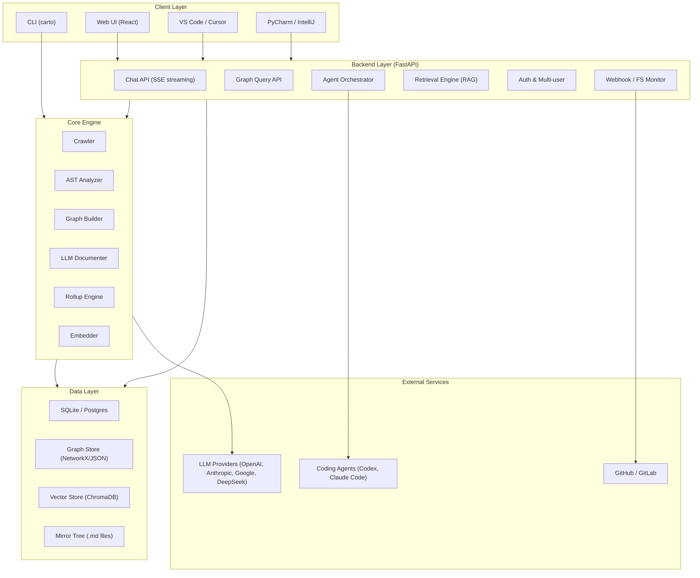
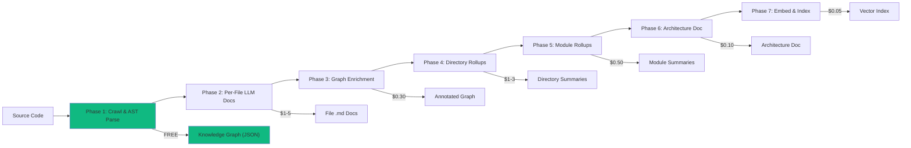
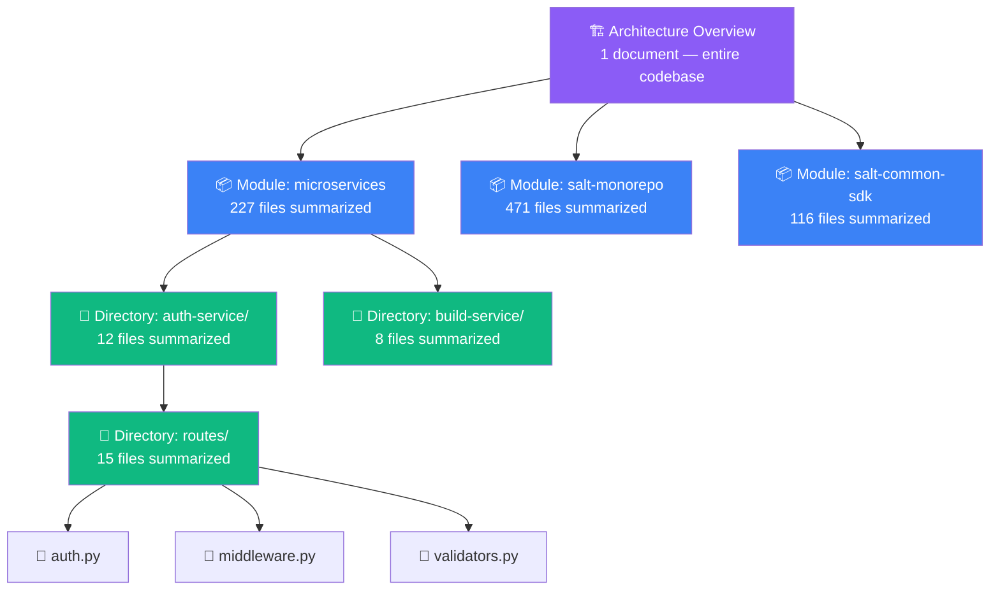
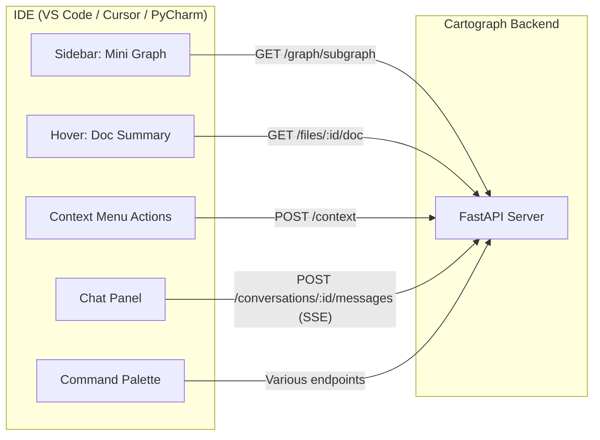
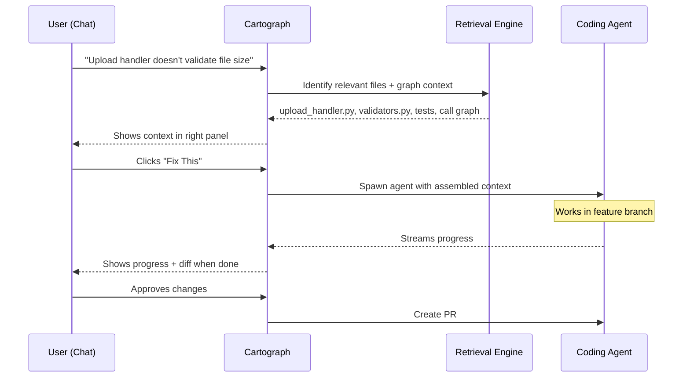
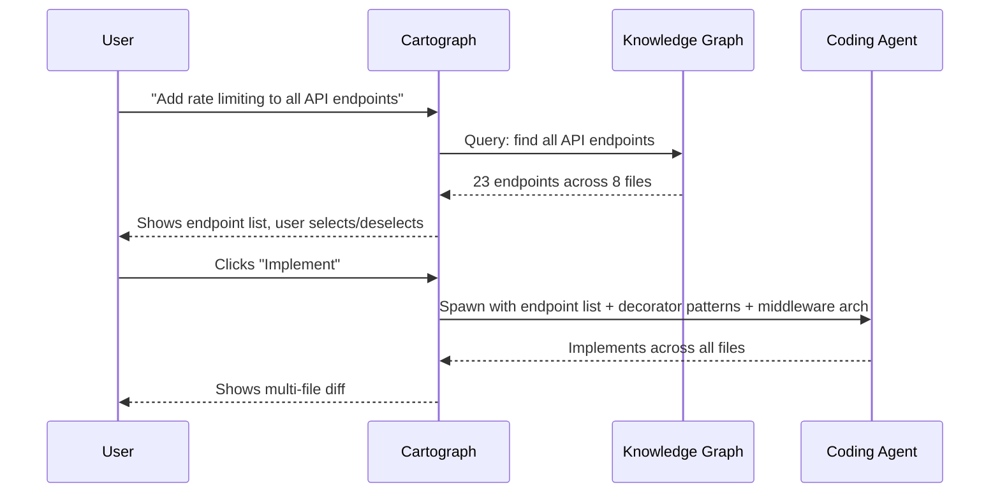
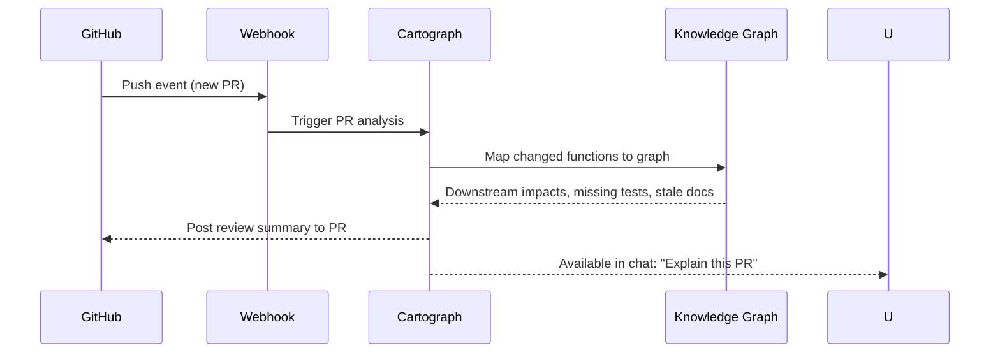
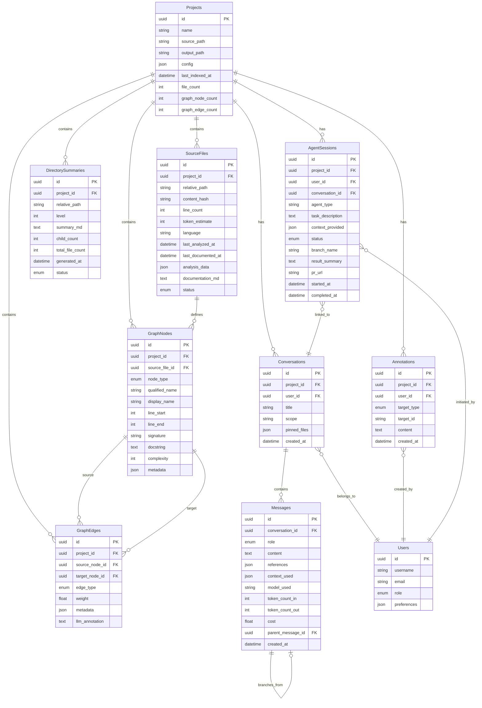
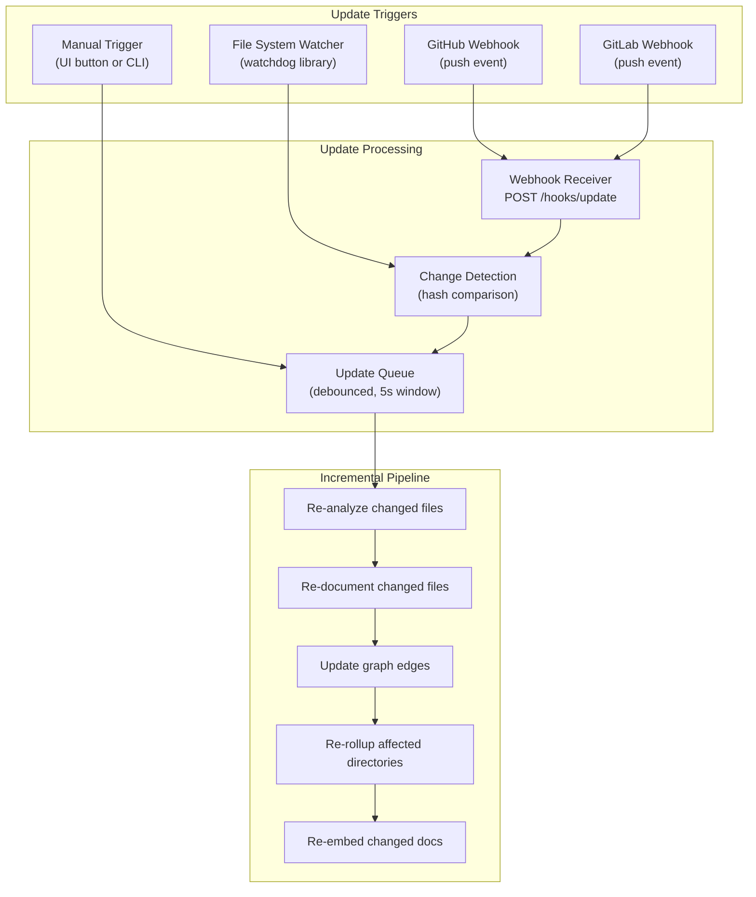
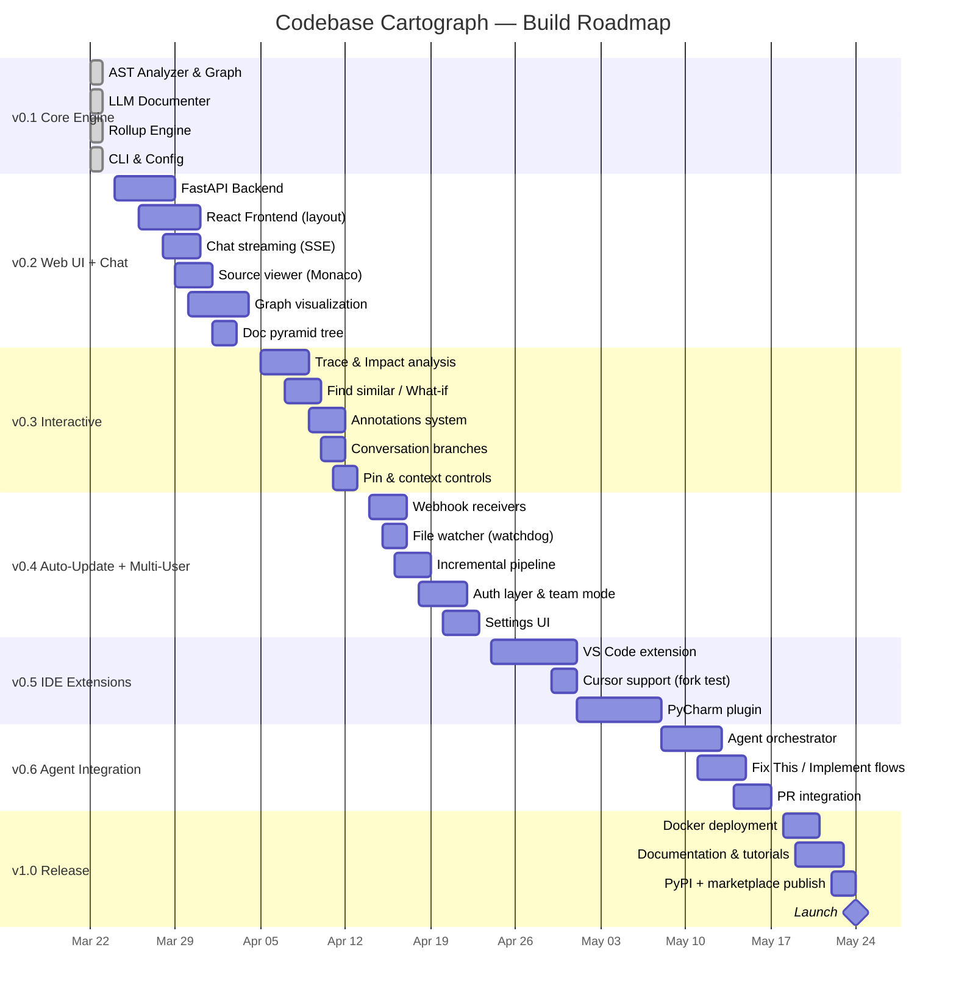

# Product Requirements Document (PRD)

## Codebase Cartograph — *Map your codebase. Understand everything.*

> **Status:** Draft v1.0  
> **Date:** March 22, 2026  
> **Author:** JBOC / Salt AI Engineering  
> **Repository:** [tornadoslims/codebase-cartograph](https://github.com/tornadoslims/codebase-cartograph)

---

## Table of Contents

1. [Executive Summary](#1-executive-summary)
2. [Problem Statement](#2-problem-statement)
3. [Vision & Goals](#3-vision--goals)
4. [Target Users](#4-target-users)
5. [System Architecture](#5-system-architecture)
6. [Core Engine (CLI)](#6-core-engine-cli)
7. [Web UI](#7-web-ui)
8. [IDE Extensions](#8-ide-extensions)
9. [Coding Agent Integration](#9-coding-agent-integration)
10. [Data Model](#10-data-model)
11. [API Contracts](#11-api-contracts)
12. [Auto-Update System](#12-auto-update-system)
13. [Configuration](#13-configuration)
14. [Cost Analysis](#14-cost-analysis)
15. [Build Phases & Roadmap](#15-build-phases--roadmap)
16. [Tech Stack](#16-tech-stack)
17. [Non-Functional Requirements](#17-non-functional-requirements)

---

## 1. Executive Summary

Codebase Cartograph is an **open-source, AI-powered codebase intelligence platform** that transforms any codebase into a navigable, queryable knowledge system. It combines static analysis, LLM-powered documentation generation, knowledge graph construction, and a conversational interface to let both humans and AI agents deeply understand codebases.

**Core value proposition:** Instead of reading thousands of files to understand a codebase, users interact with a structured documentation pyramid, an interactive knowledge graph, and a chat interface that routes questions to the right level of detail automatically.

**Key differentiators:**
- **Hierarchical documentation pyramid** — file → directory → module → architecture summaries
- **Knowledge graph** — not just docs, but a queryable map of how everything connects
- **"Chat with your codebase"** — RAG-powered conversational interface with visual context
- **Coding agent integration** — hand off tasks to AI agents with perfect context
- **IDE-native** — VS Code, Cursor, and PyCharm extensions
- **Fully configurable** — any LLM provider, any model, any codebase
- **Self-contained** — runs on a laptop or deploys for a team

---

## 2. Problem Statement

### The Challenge

Modern codebases are large, complex, and poorly documented. The Salt AI `ai-studio` repository alone contains **977 Python files across 158K lines of code** spanning microservices, SDKs, node systems, and infrastructure tooling.

### Current Pain Points

| Pain Point | Impact |
|---|---|
| **Onboarding takes weeks** | New developers spend days reading code before contributing |
| **LLMs lack context** | AI coding assistants choke on large repos — too many files for context windows |
| **Documentation is stale** | Manual docs drift from reality within days of being written |
| **Architecture is tribal knowledge** | How modules connect lives in senior devs' heads, not in docs |
| **Code review lacks context** | Reviewers don't know the full impact of changes |
| **No "find similar"** | Developers reinvent patterns that already exist in the codebase |

### The Cost

- **Developer time**: ~30% of engineering time spent understanding existing code (industry average)
- **AI inefficiency**: Coding agents produce wrong/inconsistent code without proper context
- **Knowledge loss**: When senior developers leave, architectural understanding leaves with them

---

## 3. Vision & Goals

### Vision

A world where every codebase is immediately understandable — where a new developer, an AI agent, or a curious PM can ask any question about any codebase and get an accurate, contextual answer in seconds.

### Goals

| Goal | Metric |
|---|---|
| **Reduce onboarding time** | New dev productive in days, not weeks |
| **Improve AI coding accuracy** | Agents produce codebase-consistent code on first attempt |
| **Keep docs perpetually fresh** | Auto-update within minutes of code changes |
| **Make architecture visible** | Interactive graph accessible to all stakeholders |
| **Enable self-service understanding** | Any question answered without bothering a senior dev |

### Non-Goals (v1)

- Not a code editor or IDE replacement
- Not a CI/CD tool
- Not a code review system (though it supports reviews)
- Not language-specific (Python first, extensible to others)

---

## 4. Target Users

### Primary Users

**Software Engineers** — Understand unfamiliar code, navigate dependencies, find patterns, get context for changes.

**AI Coding Agents** — Consume the documentation pyramid and knowledge graph as context for generating accurate, consistent code.

**Engineering Managers / Tech Leads** — Understand architecture, assess impact of changes, identify tech debt and complexity hotspots.

### Secondary Users

**Product Managers** — Understand what systems do at a high level without reading code.

**QA Engineers** — Understand test coverage, identify untested paths, trace data flow.

**New Hires** — Self-service onboarding with guided exploration of the codebase.

---

## 5. System Architecture

### High-Level Architecture



### Processing Pipeline



### Documentation Pyramid



---

## 6. Core Engine (CLI)

### Commands

| Command | Description | LLM Required |
|---|---|---|
| `carto analyze <path>` | AST parse + build knowledge graph | ❌ Free |
| `carto document <path>` | Generate per-file .md documentation | ✅ |
| `carto enrich <path>` | Annotate graph edges with semantic meaning | ✅ |
| `carto rollup <path>` | Generate hierarchical summaries | ✅ |
| `carto run <path>` | All phases in sequence | ✅ |
| `carto chat <path>` | Interactive chat REPL | ✅ |
| `carto context <path> <query>` | Export relevant context for external use | ✅ |
| `carto stats <path>` | Show codebase stats + cost estimates | ❌ Free |
| `carto serve` | Launch web UI + API server | ❌ |

### Phase 1: Static Analysis (AST)

**Input:** Source code files  
**Output:** Knowledge graph (JSON) + analysis cache

**Extracts:**
- **Imports** — internal vs external, aliased imports, star imports
- **Functions** — signatures, args with type hints, return types, decorators, docstrings, complexity score
- **Classes** — bases, methods, class variables, decorators, metaclasses
- **Call graph** — which functions call which other functions (cross-file)
- **Module variables** — constants, configuration, type aliases
- **Dependency edges** — typed relationships between all entities

**Knowledge graph edge types:**

| Edge Type | Meaning | Example |
|---|---|---|
| `imports` | Module imports another | `auth.py → jwt_utils.py` |
| `calls` | Function calls another function | `validate_user() → check_token()` |
| `inherits` | Class extends another | `AdminUser → BaseUser` |
| `composes` | Class holds reference to another | `UserService has DBConnection` |
| `decorates` | Decorator applied to function/class | `@require_auth → upload_handler` |
| `uses` | Variable/type reference | `handler uses UserSchema` |

### Phase 2: Per-File Documentation

**Input:** Source file + AST analysis + local graph context  
**Output:** Structured markdown document

**Document structure:**
```markdown
# auth.py

## Purpose
One-paragraph description of what this file does and why it exists.

## Dependencies
- **Internal:** jwt_utils.py (token validation), user_model.py (data types)
- **External:** fastapi, pydantic, jose

## Classes

### AuthMiddleware
Base: `BaseHTTPMiddleware`
Purpose: Intercepts requests to validate JWT tokens.
Methods:
- `dispatch(request, call_next)` — Main middleware handler
- `_extract_token(request)` — Pulls JWT from Authorization header

## Functions

### validate_token(token: str) → TokenPayload
Validates and decodes a JWT token. Raises `AuthError` if expired or invalid.
Called by: `AuthMiddleware.dispatch`, `websocket_auth`
Calls: `jose.jwt.decode`, `TokenPayload.model_validate`

### require_auth(scopes: list[str]) → Callable
Decorator factory that creates auth dependency with required scopes.
Used by: 14 route handlers across 6 files

## Data Flow
Request → AuthMiddleware.dispatch → _extract_token → validate_token → route handler

## Side Effects
- Reads JWT_SECRET from environment variables
- Logs authentication failures to structured logger
- Raises HTTP 401/403 on auth failure
```

### Phase 3: Graph Enrichment

Takes the raw AST-extracted graph and adds semantic meaning via LLM:
- **Why** does A call B (not just that it does)
- **Data flow** annotations on edges (what data passes between)
- **Pattern identification** (this is a factory, this is a middleware chain, etc.)

### Phase 4: Hierarchical Rollup

Bottom-up summarization:
1. **Leaf directories** — summarize all file docs in a directory
2. **Parent directories** — summarize child directory summaries
3. **Module level** — summarize top-level project directories
4. **Architecture level** — one document summarizing the entire codebase

Each level captures not just *what's in* the children, but *how they relate to each other*.

---

## 7. Web UI

### Layout

```
┌─────────────────────────────────────────────────────────────────┐
│  🧭 [Project ▼] [Scope: module/auth ▼]            [⚙️] [👤]   │
├──────────────────────────────┬──────────────────────────────────┤
│                              │  [Source] [Graph] [Docs]         │
│    💬 CHAT PANEL             │  [Dependencies] [Examples]       │
│    (60% width, resizable)    │                                  │
│                              │    CONTEXT PANEL                 │
│    Streaming conversation    │    (40% width, tabbed)           │
│    with clickable refs       │                                  │
│    and action buttons        │    Updates dynamically           │
│                              │    as chat responds              │
│    ┌─────────────────────┐   │                                  │
│    │ [📌 pinned files]   │   │                                  │
│    │ [/trace] [@file] [+]│   │                                  │
│    │ [Message input...  ]│   │  ┌────────────────────────────┐  │
│    └─────────────────────┘   │  │ Token: 34K/128K │ 💰$0.03  │  │
├──────────────────────────────┴──┴────────────────────────────┘  │
│  📊 977 files indexed │ 4.2K graph nodes │ Last updated: 2m ago │
└─────────────────────────────────────────────────────────────────┘
```

### Chat Panel Features

| Feature | Description |
|---|---|
| **Streaming responses** | Token-by-token SSE rendering |
| **Clickable references** | `auth.py:42` links navigate the context panel |
| **Action buttons** | 🔍 Trace, 🔧 Fix This, 📋 Export, 🔄 Regenerate |
| **Slash commands** | `/trace fn`, `/impact file`, `/similar pattern`, `/scope path` |
| **File autocomplete** | `@auth.py` — autocomplete file/function names |
| **Pin context** | `+auth.py` keeps files in persistent context |
| **Depth control** | `/depth architecture \| module \| file \| source` |
| **Conversation branches** | Fork at any message for "what if" exploration |
| **Suggested follow-ups** | 3-4 contextual next questions after each answer |
| **Conversation history** | Saved per-project, searchable |

### Context Panel Tabs

#### Tab 1: Source View
- **Monaco editor** (read-only) — VS Code's renderer
- Multi-file tabs within the panel
- **Highlighted regions** that chat is referencing (yellow glow animation)
- Gutter annotations: complexity, dependency count, test coverage
- **"Open in IDE"** button → launches VS Code/Cursor/PyCharm at exact file:line
- Diff mode toggle for git changes

#### Tab 2: Knowledge Graph (Interactive)
- **Cytoscape.js** force-directed graph visualization
- **Semantic zoom levels:**
  - Zoomed out → module clusters (colored bubbles)
  - Mid zoom → file nodes within modules
  - Zoomed in → class/function nodes within files
- **Edge type visualization:**

| Edge Type | Visual Style |
|---|---|
| Imports | Dashed gray line |
| Function calls | Solid blue arrow |
| Inheritance | Thick green line |
| Composition | Dotted orange line |
| Decorates | Purple line |

- **Live highlighting**: nodes pulse/glow as chat discusses them
- **Click interactions**: click node → summary tooltip + source navigation
- **Filters**: toggle edge types, filter by module, search nodes
- **Layout modes**: force-directed, hierarchical, circular, tree
- **Export**: SVG/PNG snapshot of current view

#### Tab 3: Documentation Pyramid
- Collapsible tree view (file explorer style)
- Level icons: 🏗️ architecture, 📦 module, 📁 directory, 📄 file
- Click any node → renders markdown in-place
- Staleness indicator: ⚠️ when source changed since generation
- Search within docs
- Team annotations with author + timestamp

#### Tab 4: Dependencies
- Two-column: **Upstream** | **Downstream**
- Visual DAG (pipeline diagram)
- External deps link to PyPI/docs
- **Impact radius**: "change this → N files affected"
- Expandable: click a dep → see which functions/classes are used

#### Tab 5: Examples & Patterns
- Similar code across the codebase
- Test examples for the current topic
- Usage examples (how other code calls this)
- Pattern classification: "Repository Pattern", "Factory", "Middleware Chain"

### Interactive Features

| Feature | Description |
|---|---|
| **Trace** | Click a function → animated call trace through the graph |
| **Impact Analysis** | "What if I changed this?" → highlight cascade in graph |
| **Find Similar** | Right-click code → find other places using the same pattern |
| **What-If Mode** | "What if I deleted this class?" → show everything that breaks |
| **Comparison** | Side-by-side module comparison (graph + docs) |
| **Explain Like I'm...** | Toggle depth: junior / senior / PM / AI agent |
| **Annotations** | Team notes on any doc/node that persist and accumulate |
| **Pin Context** | Pin files/functions to always be in chat context |
| **Export Conversation** | Chat + context panel → shareable document |
| **Git-Aware** | "What changed in last 5 commits affecting this module?" |

---

## 8. IDE Extensions

### Architecture

IDE extensions are **thin clients** that call the Cartograph API. No engine logic in the extension — just UI.



### VS Code / Cursor Extension

| Feature | Description |
|---|---|
| **Sidebar panel** | Mini knowledge graph for current file |
| **Hover enrichment** | Hover function → Cartograph doc summary + callers/callees |
| **"Explain this"** | Right-click → opens chat focused on selection |
| **"Impact of change"** | Right-click function → see affected files |
| **"Find similar"** | Right-click pattern → find matches across codebase |
| **Inline annotations** | Subtle decorations: dependency count, complexity |
| **Chat panel** | Full chat interface embedded in editor |
| **Command palette** | `Cartograph: Trace`, `Cartograph: Dependencies`, `Cartograph: Explain` |
| **Status bar** | Connection status, last index time, file doc staleness |

### PyCharm / IntelliJ Plugin

Same features, adapted to JetBrains platform:
- Tool window instead of sidebar
- Intention actions instead of right-click menu
- Built in Kotlin (required by JetBrains API)
- Same backend API

**Priority:** VS Code/Cursor first (same codebase), PyCharm second.

---

## 9. Coding Agent Integration

### The Killer Feature

Cartograph doesn't just document code — it becomes an **AI coding accelerator** by providing perfect context to coding agents.

### "Fix This" Flow



### "Implement Feature" Flow



### "Review PR" Flow



### Agent Configuration

| Setting | Options |
|---|---|
| **Agent type** | Codex, Claude Code, custom command |
| **Model per agent** | Configurable in settings UI |
| **Working directory** | Auto-creates feature branch |
| **Branch strategy** | `fix/<task>`, `feature/<task>`, custom pattern |
| **Auto-PR** | Automatic or manual review |
| **Sandboxing** | Full sandbox, workspace-only, or unrestricted |

---

## 10. Data Model

### Entity Relationship Diagram



---

## 11. API Contracts

### Project Management

```
GET    /api/projects                              → List all projects
POST   /api/projects                              → Create project
GET    /api/projects/:id                          → Project details + stats
PATCH  /api/projects/:id                          → Update config
DELETE /api/projects/:id                          → Remove project
POST   /api/projects/:id/index                    → Full re-index
POST   /api/projects/:id/index/incremental        → Incremental update
```

### Graph & Source

```
GET    /api/projects/:id/graph                    → Full graph (JSON)
GET    /api/projects/:id/graph/subgraph           → Local subgraph
         ?node=X&depth=2
GET    /api/projects/:id/graph/nodes              → Search nodes
         ?type=function&search=auth
GET    /api/projects/:id/graph/node/:nodeId       → Node details + edges
GET    /api/projects/:id/graph/trace/:nodeId      → Full call trace
GET    /api/projects/:id/graph/impact/:nodeId     → Impact analysis
GET    /api/projects/:id/graph/similar/:nodeId    → Similar patterns
GET    /api/projects/:id/graph/mermaid?scope=path → Mermaid diagram

GET    /api/projects/:id/files                    → File listing
GET    /api/projects/:id/files/:fileId            → File details
GET    /api/projects/:id/files/:fileId/source     → Raw source code
GET    /api/projects/:id/files/:fileId/doc        → Generated documentation
```

### Documentation Pyramid

```
GET    /api/projects/:id/docs/tree                → Doc tree structure
GET    /api/projects/:id/docs/:path               → Doc at path
GET    /api/projects/:id/docs/architecture        → Top-level doc
GET    /api/projects/:id/docs/search?q=auth       → Search docs
```

### Chat (Streaming)

```
GET    /api/projects/:id/conversations            → List conversations
POST   /api/projects/:id/conversations            → New conversation
GET    /api/conversations/:convId/messages         → Message history
POST   /api/conversations/:convId/messages         → Send message
DELETE /api/conversations/:convId                  → Delete conversation
POST   /api/conversations/:convId/messages/:msgId/branch → Branch
```

**Chat SSE Event Types:**

```json
{"type": "token", "content": "The"}
{"type": "reference", "file": "auth.py", "line": 42, "node_id": "..."}
{"type": "graph_highlight", "nodes": ["node1", "node2"], "edges": ["edge1"]}
{"type": "context_used", "docs": [...], "tokens": 6200}
{"type": "done", "cost": 0.003, "model": "gemini-2.5-pro"}
{"type": "suggestions", "questions": ["How does...", "What if..."]}
```

### Context Export

```
POST   /api/projects/:id/context
  Request:  {query, depth, max_tokens}
  Response: {docs, graph, source_snippets, total_tokens}
```

### Annotations

```
GET    /api/projects/:id/annotations?target=file:auth.py
POST   /api/projects/:id/annotations
DELETE /api/annotations/:id
```

### Agent Integration

```
POST   /api/projects/:id/agents/run               → Spawn agent
GET    /api/agents/:sessionId                      → Status + logs
POST   /api/agents/:sessionId/approve              → Approve changes
DELETE /api/agents/:sessionId                       → Kill agent
```

### Webhooks & Auto-Update

```
POST   /api/hooks/github                           → GitHub webhook
POST   /api/hooks/gitlab                           → GitLab webhook
GET    /api/projects/:id/watcher                   → Watcher status
PATCH  /api/projects/:id/watcher                   → Configure watcher
GET    /api/projects/:id/updates                   → Update log
```

### Settings & Admin

```
GET    /api/settings                               → Current config
PATCH  /api/settings                               → Update config
GET    /api/settings/models                        → Available models
GET    /api/usage                                  → Usage/cost stats
GET    /api/users                                  → User management
```

---

## 12. Auto-Update System

### Update Triggers



### Configuration (UI Settings Panel)

| Setting | Options | Default |
|---|---|---|
| **Update method** | Webhook / File watcher / Manual only | Manual |
| **Webhook URL** | Auto-generated, copyable | — |
| **Watch paths** | Include/exclude glob patterns | All source files |
| **Debounce interval** | Seconds to wait before processing | 5s |
| **Auto-rollup** | Re-rollup affected directories on change | Yes |
| **Notification** | Alert in UI when update completes | Yes |

---

## 13. Configuration

### Configuration File (`config.yaml`)

```yaml
# ============================================================
# Codebase Cartograph Configuration
# Copy to config.yaml and fill in your API keys
# ============================================================

# --- API Keys ---
api_keys:
  openai: ""          # sk-... (for embeddings, GPT models)
  anthropic: ""       # sk-ant-... (for Claude models)
  google: ""          # AIza... (for Gemini models)
  deepseek: ""        # (for DeepSeek models)

# --- Model Selection (per phase) ---
# Format: provider/model-name (via litellm)
models:
  file_documentation: "gemini/gemini-2.5-flash"
  graph_enrichment: "gemini/gemini-2.5-flash"
  rollup_summaries: "gemini/gemini-2.5-pro"
  chat: "anthropic/claude-sonnet-4-20250514"
  embeddings: "openai/text-embedding-3-small"

# --- Processing ---
processing:
  concurrency: 10                 # Parallel LLM calls
  skip_tiny_files: true           # Skip files ≤ threshold
  tiny_file_threshold: 10         # Lines
  file_extensions: [".py"]        # Extensible: .ts, .js, .go, etc.
  exclude_patterns:
    - "**/test_*"
    - "**/.git/**"
    - "**/migrations/**"
    - "**/__pycache__/**"
    - "**/venv/**"
    - "**/.venv/**"
    - "**/node_modules/**"

# --- Output ---
output:
  output_dir: "./docs-mirror"
  graph_format: "json"            # json, sqlite, or both
  generate_mermaid: true
  include_source_links: true

# --- Chat ---
chat:
  retrieval_method: "keyword"     # "keyword" or "vector"
  top_k: 10
  include_source: true
  history_length: 10

# --- Server ---
server:
  host: "0.0.0.0"
  port: 8420
  mode: "solo"                    # "solo" or "team"
  auth_method: "none"             # "none", "api_key", "oauth"

# --- Auto-Update ---
updates:
  method: "manual"                # "manual", "webhook", "watcher"
  debounce_seconds: 5
  auto_rollup: true
```

### Settings UI

All configuration is also editable through the web UI settings panel:

```
┌─────────────────────────────────────────────┐
│  ⚙️ Settings                                │
│                                             │
│  📁 Projects                                │
│  ├ Add/remove codebases                     │
│  ├ Re-index / rebuild all                   │
│  └ Per-project model overrides              │
│                                             │
│  🤖 Models                                  │
│  ├ Model per phase (dropdown + test button) │
│  └ API keys (encrypted, masked display)     │
│                                             │
│  🔄 Auto-Update                             │
│  ├ Method: webhook / file watcher / manual  │
│  ├ Webhook URL (copy button + setup guide)  │
│  ├ Watch paths (include/exclude)            │
│  └ Update log (history of changes)          │
│                                             │
│  🛠️ Coding Agents                          │
│  ├ Available agents (auto-detected)         │
│  ├ Default agent per task type              │
│  └ Branch naming / PR settings              │
│                                             │
│  👥 Team (team mode only)                   │
│  ├ Users & roles                            │
│  ├ SSO / OAuth configuration                │
│  └ Shared annotation settings               │
│                                             │
│  💰 Usage Dashboard                         │
│  ├ Token usage by phase (chart)             │
│  ├ Cost over time (chart)                   │
│  └ Budget alerts                            │
└─────────────────────────────────────────────┘
```

---

## 14. Cost Analysis

### Reference Codebase: Salt AI ai-studio

| Metric | Value |
|---|---|
| Python files | 977 |
| Lines of code | 158,000 |
| Total size | 5.8 MB |
| Estimated tokens | ~1.5M input |
| Directories | 1,467 |
| Max depth | 15 levels |
| Top-level projects | 11 |

### File Size Distribution

| Category | Count | Strategy |
|---|---|---|
| ≤10 lines (tiny) | 144 | Skip (index only) |
| 11-50 lines (small) | 98 | Cheap to process |
| 51-200 lines (medium) | 439 | Bulk of the work |
| 201-500 lines (large) | 258 | Substantial files |
| 500+ lines (huge) | 38 | Largest: 2,379 lines |

### Cost by Model Strategy

#### Budget Strategy (~$5-7)

| Phase | Model | Cost |
|---|---|---|
| Phase 1: AST Analysis | Local (free) | $0.00 |
| Phase 2: Per-file docs | Gemini 2.5 Flash | $1.40 |
| Phase 3: Graph enrichment | Gemini 2.5 Flash | $0.30 |
| Phase 4: Rollups | Gemini 2.5 Pro | $3.00 |
| Phase 5: Embeddings | text-embedding-3-small | $0.05 |
| **Total** | | **~$4.75** |

#### Premium Strategy (~$34)

| Phase | Model | Cost |
|---|---|---|
| Phase 1: AST Analysis | Local (free) | $0.00 |
| Phase 2: Per-file docs | Gemini 2.5 Pro | $26.00 |
| Phase 3: Graph enrichment | Gemini 2.5 Pro | $5.00 |
| Phase 4: Rollups | Gemini 2.5 Pro | $3.00 |
| Phase 5: Embeddings | text-embedding-3-small | $0.05 |
| **Total** | | **~$34.05** |

#### Maximum Quality (~$233)

| Phase | Model | Cost |
|---|---|---|
| Phase 1: AST Analysis | Local (free) | $0.00 |
| Phase 2: Per-file docs | Claude Opus 4 | $173.00 |
| Phase 3: Graph enrichment | Claude Opus 4 | $35.00 |
| Phase 4: Rollups | Claude Opus 4 | $25.00 |
| Phase 5: Embeddings | text-embedding-3-small | $0.05 |
| **Total** | | **~$233.05** |

### Incremental Update Costs

After initial indexing, updates only re-process changed files. Typical cost for a 10-file change: **$0.02-0.50** depending on model choice.

---

## 15. Build Phases & Roadmap



### Phase Details

| Version | Target | Key Deliverables |
|---|---|---|
| **v0.1** ✅ | Mar 22 | Core engine, CLI, AST analyzer, graph, LLM docs, rollups |
| **v0.2** | Apr 4 | Web UI, chat interface, source viewer, graph viz |
| **v0.3** | Apr 13 | Trace, impact, find similar, annotations, branches |
| **v0.4** | Apr 23 | Webhooks, file watcher, auth, team mode, settings UI |
| **v0.5** | May 7 | VS Code, Cursor, PyCharm extensions |
| **v0.6** | May 17 | Agent orchestrator, Fix This, PR integration |
| **v1.0** | May 24 | Docker, docs, PyPI, marketplace, launch |

---

## 16. Tech Stack

### Backend

| Component | Technology | Rationale |
|---|---|---|
| **Language** | Python 3.11+ | Same ecosystem as target codebases |
| **Web framework** | FastAPI | Async, fast, OpenAPI docs built-in |
| **LLM client** | litellm | Unified interface for all providers |
| **Graph engine** | NetworkX | Pure Python, batteries included |
| **Database** | SQLite (solo) / Postgres (team) | Zero-config vs production-ready |
| **Vector store** | ChromaDB (local) / Pinecone (cloud) | Embedded vs scalable |
| **AST parsing** | Python `ast` module | Standard library, deterministic |
| **Task queue** | asyncio + semaphore | No external deps for solo mode |
| **File watching** | watchdog | Cross-platform, mature |
| **CLI** | Click | Clean, composable, well-documented |
| **Config** | Pydantic + PyYAML | Validated, typed configuration |
| **Output** | Rich | Progress bars, tables, console formatting |

### Frontend

| Component | Technology | Rationale |
|---|---|---|
| **Framework** | React 18 + TypeScript | Ecosystem, components, talent pool |
| **Build** | Vite | Fast builds, modern defaults |
| **UI library** | shadcn/ui + Tailwind | Customizable, not opinionated |
| **Code viewer** | Monaco Editor | VS Code's renderer, full-featured |
| **Graph viz** | Cytoscape.js | Best for code/network graphs |
| **Markdown** | react-markdown + rehype | Flexible rendering pipeline |
| **State** | Zustand | Simple, fast, minimal boilerplate |
| **Streaming** | EventSource API | Native SSE support |
| **Routing** | React Router v7 | Standard, mature |

### IDE Extensions

| Platform | Technology |
|---|---|
| **VS Code / Cursor** | TypeScript, VS Code Extension API |
| **PyCharm / IntelliJ** | Kotlin, IntelliJ Platform SDK |

### DevOps

| Component | Technology |
|---|---|
| **Containerization** | Docker + docker-compose |
| **CI/CD** | GitHub Actions |
| **Package** | PyPI (backend), npm (frontend), VS Code Marketplace, JetBrains Marketplace |

---

## 17. Non-Functional Requirements

### Performance

| Metric | Target |
|---|---|
| AST analysis (1000 files) | < 5 seconds |
| Chat response (first token) | < 2 seconds |
| Graph render (5000 nodes) | < 1 second |
| Incremental update (10 files) | < 30 seconds |
| Full index (1000 files) | < 30 minutes |
| UI initial load | < 3 seconds |

### Scalability

| Dimension | Solo Mode | Team Mode |
|---|---|---|
| Concurrent users | 1 | 50+ |
| Codebase size | Up to 10K files | Up to 100K files |
| Graph nodes | Up to 50K | Up to 500K |
| Conversations | Unlimited | Unlimited |
| Storage | ~100MB per project | Scales with Postgres |

### Security

| Requirement | Implementation |
|---|---|
| API keys at rest | Encrypted in config, masked in UI |
| Source code access | Never leaves the server; only docs/summaries sent to LLMs |
| Auth (team mode) | OAuth 2.0 / API keys / SSO |
| RBAC | Admin, Member, Viewer roles |
| Network | HTTPS in production, localhost in solo mode |
| Audit log | All LLM calls logged with cost and tokens |

### Reliability

| Requirement | Implementation |
|---|---|
| LLM call retry | Exponential backoff with jitter (3 retries) |
| Incremental indexing | Hash-based change detection, never re-processes unchanged files |
| Crash recovery | Pipeline state persisted; resume from last checkpoint |
| Data backup | SQLite export, graph JSON always on disk |

### Extensibility

| Dimension | Approach |
|---|---|
| **Languages** | Plugin system: add parsers for .ts, .js, .go, .rs, .java |
| **LLM providers** | litellm supports 100+ providers out of the box |
| **Graph backends** | Swappable: NetworkX (local), Neo4j (production) |
| **Vector backends** | Swappable: ChromaDB (local), Pinecone, Weaviate |
| **Prompts** | External .md files, fully customizable per project |
| **Output formats** | Markdown, JSON, HTML, PDF export |

---

## Appendix A: Glossary

| Term | Definition |
|---|---|
| **Documentation Pyramid** | Hierarchical docs: file → directory → module → architecture |
| **Knowledge Graph** | Network of code entities and their relationships |
| **RAG** | Retrieval-Augmented Generation — feeding relevant docs to an LLM |
| **AST** | Abstract Syntax Tree — structured representation of source code |
| **Enrichment** | LLM-annotated semantic meaning on graph edges |
| **Rollup** | Summarizing child docs into parent-level summaries |
| **Impact Analysis** | Tracing what would be affected by a code change |
| **Context Export** | Extracting relevant docs/graph for external LLM/agent use |

---

*Document generated: March 22, 2026*  
*Repository: [tornadoslims/codebase-cartograph](https://github.com/tornadoslims/codebase-cartograph)*
